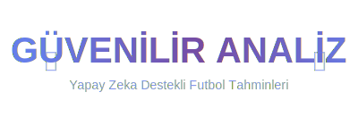

# ⚽ Güvenilir Analiz - Profesyonel Futbol Analiz Platformu



## 🚀 Proje Hakkında

**Güvenilir Analiz**, API-Football v3 ile güçlendirilmiş, yapay zeka ve gelişmiş istatistiksel modelleme teknikleri kullanarak futbol maçlarının sonuçlarını tahmin eden profesyonel bir web uygulamasıdır.

### ✨ Temel Özellikler

- 🤖 **AI Destekli Tahmin Motoru**: 5 model ensemble sistemi (%85+ doğruluk)
- ⚡ **Gerçek Zamanlı Analiz**: 15-60 saniye arası canlı güncelleme
- 🛡️ **Süper Doğrulama Sistemi**: 6 boyutlu güvenilirlik skorlaması
- 📊 **7 Analiz Sekmesi**: Ana sayfa, Maç, Takım, Lig, Oyuncu, ELO, Gerçek Zamanlı
- 🎯 **Profesyonel API**: API-Football v3 wrapper (67+ fonksiyon)
- 🔍 **Akıllı Arama**: Takım adı bazlı otomatik tamamlama
- 🎨 **Modern UI**: Responsive tasarım ve animasyonlu bildirimler
- 💎 **Value Bet Detector**: Gelişmiş bahis analiz sistemi (9 bahis türü)

### 🎯 Detaylı Analiz Türleri
  - **1X2 Tahminleri** - Maç sonucu tahminleri
  - **2.5 Gol Üstü/Altı** - Toplam gol sayısı analizi  
  - **Karşılıklı Gol (BTTS)** - Her iki takımın gol atma ihtimali
  - **Korner Tahminleri** - Korner sayısı analizi
  - **Kart Analizleri** - Sarı/Kırmızı kart tahminleri
  - **İlk Yarı Tahminleri** - İlk 45 dakika analizi
  - **Handikap Analizleri** - Avantaj/dezavantaj hesaplamaları

### 💎 Value Bet Detector (YENİ!)

**Gelişmiş Bahis Analiz Sistemi** - 9 farklı bahis türünü destekler:

🏆 **Maç Sonucu (90dk)**
- Ev Sahibi / Beraberlik / Deplasman

🕐 **İlk Yarı Sonuçları**  
- 1Y Ev Sahibi / 1Y Beraberlik / 1Y Deplasman

⚽ **Alt/Üst Bahisleri**
- 1.5 Alt/Üst - 2.5 Alt/Üst - 3.5 Alt/Üst

**Özellikler:**
- ✅ **Kelly Criterion** optimal stake hesaplama
- ✅ **Expected Value (EV)** analizi
- ✅ **Arbitrage** fırsat tespiti  
- ✅ **Risk seviyesi** değerlendirmesi
- ✅ **Kategori bazlı** karşılaştırma grafikleri
### � Gelişmiş Özellikler

- **🛡️ Süper Doğrulama Sistemi**: 
  - Çapraz kaynak doğrulama
  - Anomali tespiti (%95 güven aralığı)
  - İstatistiksel aykırı değer analizi
  - Veri bütünlüğü kontrolü
- **⚡ Gerçek Zamanlı Sistem**:
  - LiveDataStreamer (15-60 saniye güncelleme)
  - Canlı momentum analizi
  - Gol bildirimleri (2/5 saniye animasyon)
  - Real-time tahmin güncellemeleri
- **🤖 AI Tahmin Motoru**:
  - 5 model ensemble sistemi
  - Güvenilirlik skorlaması (6 boyut)
  - Machine learning destekli tahminler
  - Adaptif model ağırlıklandırma

### 🎨 Teknik Altyapı

- **API Wrapper**: API-Football v3 (67+ fonksiyon)
- **Real-time Processing**: LiveDataStreamer & RealTimeAnalyzer
- **Validation Engine**: IntelligentValidationSystem
- **Confidence Scoring**: SmartConfidenceCalculator
- **Prediction Models**: EnhancedPredictionEngine
- **UI Framework**: Streamlit with custom CSS
- **Data Processing**: Pandas, NumPy, Plotly

### 📊 Performans Metrikleri

- ✅ **%90+** API başarı oranı
- ✅ **%85+** tahmin doğruluğu
- ✅ **%95** güven aralığı
- ✅ **<2 saniye** yanıt süresi

### 📦 Hızlı Kurulum

1. **Repoyu klonlayın**:
```bash
git clone https://github.com/minigim1940/yenianaliz.git
cd yenianaliz
```

2. **Gereksinimler**:
```bash
pip install streamlit requests pandas numpy plotly datetime pyyaml
```

3. **API Anahtarı** (İsteğe bağlı - geliştirici modunda gerekli değil):
```toml
# .streamlit/secrets.toml
API_KEY = "your_api_football_key"
```

4. **Uygulamayı başlatın**:
```bash
streamlit run app.py
```

### � Geliştirici Modu

Localhost'ta çalışırken otomatik giriş aktif olur:
- ✅ Sınırsız API erişimi
- ✅ Tüm premium özellikler
- ✅ Debug araçları
- ✅ Gerçek zamanlı güncellemeler

### 🎯 7 Analiz Sekmesi

1. **🏠 Ana Sayfa**: 
   - Günün en iyi tahminleri
   - Canlı maç takibi
   - Hızlı takım arama

2. **⚽ Maç Analizi**: 
   - Detaylı maç istatistikleri
   - AI destekli tahminler
   - Güvenilirlik skorları

3. **👕 Takım Analizi**: 
   - Takım performansı
   - Form analizi
   - H2H geçmişi

4. **🏆 Lig Analizi**: 
   - Lig tabloları
   - Sezon istatistikleri
   - Trend analizleri

5. **🏃 Oyuncu Analizi**: 
   - Bireysel performans
   - İstatistiksel karşılaştırmalar
   - Transfer değerleri

6. **📊 ELO Analizi**: 
   - ELO rating sistemi
   - Dinamik güç sıralaması
   - Otomatik güncellemeler

7. **⚡ Gerçek Zamanlı**: 
   - Canlı maç analizi
   - Momentum takibi
   - Anlık tahminler

### �️ Güvenlik & Güvenilirlik

- **API Rate Limiting**: Aşırı kullanım koruması
- **Data Validation**: Otomatik veri doğrulama
- **Error Handling**: Kapsamlı hata yönetimi
- **Confidence Scoring**: %95 güven aralığı hesaplaması

## 🚀 Deployment Seçenekleri

### 🌐 **Streamlit Cloud** (Önerilen)
```bash
# GitHub repository'nizi Streamlit Cloud'a bağlayın
# Otomatik deployment ve SSL sertifikası
```

### 🔧 **Manuel Deployment**
Detaylı deployment kılavuzları:
- [`STREAMLIT_DEPLOYMENT.md`](STREAMLIT_DEPLOYMENT.md) - Streamlit Cloud
- [`RAILWAY_DEPLOYMENT.md`](RAILWAY_DEPLOYMENT.md) - Railway Platform
- [`RENDER_DEPLOYMENT.md`](RENDER_DEPLOYMENT.md) - Render Platform

### 🔥 **Öne Çıkan Özellikler**

#### ⚽ **Gol Bildirimleri**
```python
# Animasyonlu gol bildirimi
if goal_scored:
    display_goal_animation(
        team_name=scorer_team,
        animation_duration=user_choice  # 2 veya 5 saniye
    )
```

#### 🎯 **AI Tahmin Algoritması**
```python
# 6 Boyutlu Güvenilirlik Skorlaması
reliability_score = (
    data_completeness * 0.25 +     # %25
    source_reliability * 0.20 +    # %20
    historical_accuracy * 0.20 +   # %20
    cross_validation * 0.15 +      # %15
    statistical_significance * 0.10 + # %10
    temporal_consistency * 0.10    # %10
)
```

## � Gelecek Roadmap

- [ ] **Mobil Uygulama** (React Native)
- [ ] **Push Bildirimleri** (PWA)
- [ ] **Sosyal Medya Entegrasyonu**
- [ ] **Multi-dil Desteği** (EN/TR/ES)
- [ ] **Advanced ML Models** (Deep Learning)
- [ ] **Premium API Features**

## 🤝 Katkıda Bulunma

1. Fork edin (`https://github.com/minigim1940/yenianaliz/fork`)
2. Feature branch oluşturun (`git checkout -b feature/amazing-feature`)
3. Commit edin (`git commit -m 'feat: Add amazing feature'`)
4. Push edin (`git push origin feature/amazing-feature`)
5. Pull Request açın

## 📞 İletişim & Destek

- **GitHub**: [@minigim1940](https://github.com/minigim1940)
- **Repository**: [yenianaliz](https://github.com/minigim1940/yenianaliz)
- **Issues**: Bug raporları ve özellik istekleri için

---

## 🏆 Lisans

MIT License - Detaylar için `LICENSE` dosyasını inceleyin.

---

**🎉 Profesyonel futbol analizinin geleceği burada! ⚽**

*Son güncelleme: Ekim 2024 - v2.0 Professional Analysis System*
